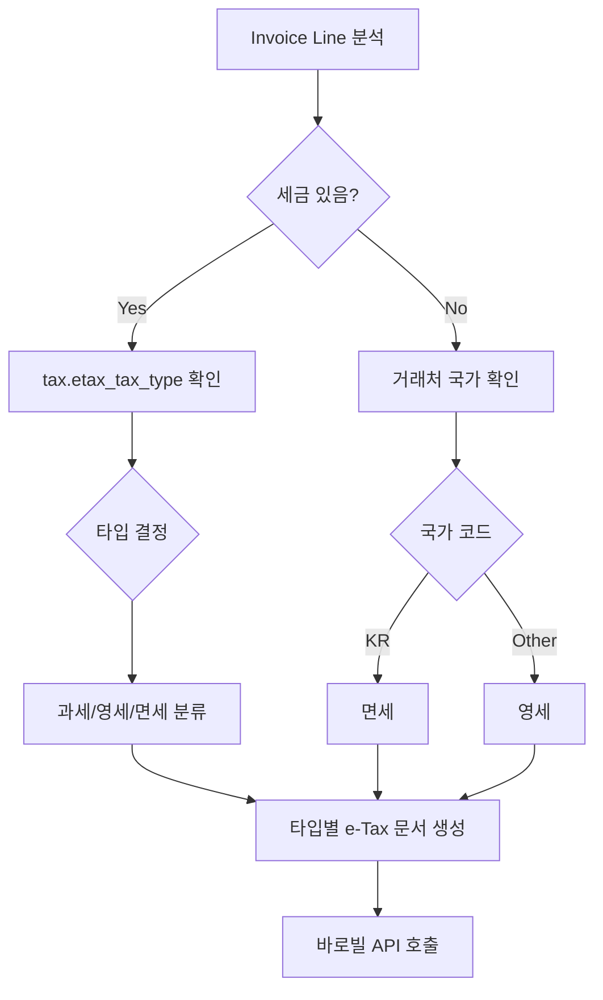

# E-Tax 세금계산서 개발 작업 (2025-09-08)

## 📋 작업 개요
- **목표**: 과세/영세/면세 타입별 세금계산서 자동 발행 시스템 구현
- **모듈**: `@linkup-etax/` (lu_etax, lu_etax_barobill)
- **핵심 기능**: `account.tax`에 e-Tax 타입 필드 추가 및 바로빌 API 연동

## 🔧 주요 구현 사항

### 1. account.tax 모델 확장
**파일**: `custom/linkup-package/linkup-etax/lu_etax/models/account_tax.py`

```python
class AccountTax(models.Model):
    _inherit = 'account.tax'

    etax_tax_type = fields.Selection([
        ('taxable', '과세'),
        ('zero_rated', '영세'),
        ('exempt', '면세'),
    ], string='E-Tax Type', default='taxable')
```

**주요 특징**:
- 각 세금에 과세/영세/면세 타입 지정 가능
- 기본값은 '과세'로 설정
- 세금계산서 발행 시 이 필드로 타입 구분

### 2. account.move 로직 개선
**파일**: `custom/linkup-package/linkup-etax/lu_etax/models/account_move.py`

#### 핵심 메서드: `_create_etax()`
- **기능**: 인보이스 라인의 세금 타입에 따라 자동으로 e-Tax 문서 분리 생성
- **로직**:
  1. 과세/비과세 라인 분석
  2. 혼재 시 → 별도 문서로 분리
  3. 단일 타입 시 → 하나의 문서로 생성

#### 새로운 헬퍼 메서드: `_get_tax_type_from_line()`
```python
def _get_tax_type_from_line(self, line, move):
    """개별 라인의 세금 타입 결정"""
    if line.tax_ids:
        # 세금의 etax_tax_type 확인
        for tax in line.tax_ids:
            if hasattr(tax, 'etax_tax_type') and tax.etax_tax_type:
                if tax.etax_tax_type == 'taxable':
                    return 'taxable'
                elif tax.etax_tax_type == 'zero_rated':
                    return 'non-taxable'
                elif tax.etax_tax_type == 'exempt':
                    return 'tax-exempt'
    else:
        # 세금 없는 라인 - 거래처 국가로 판단
        if move.partner_id.country_id and move.partner_id.country_id.code != 'KR':
            return 'non-taxable'  # 해외 = 영세
        else:
            return 'tax-exempt'  # 국내 = 면세
    
    return 'taxable'  # 기본값
```

### 3. 바로빌 API 연동 개선
**파일**: `custom/linkup-package/linkup-etax/lu_etax_barobill/models/service_provider.py`

#### 핵심 개선사항:
1. **TaxInvoiceType 동적 설정**:
   ```python
   TaxInvoiceType=2 if tax_type == 3 else 1  # 면세=계산서, 나머지=세금계산서
   ```

2. **세금 금액 처리**:
   ```python
   # 영세/면세는 강제로 "0" (문자열)
   TaxTotal="0" if tax_type in [2, 3] else str(int(total_tax))
   TotalAmount=str(int(move.amount_untaxed)) if tax_type in [2, 3] else str(int(total_amount + total_tax))
   ```

3. **라인별 세금 금액 처리**:
   ```python
   def _prepare_etax_line(self):
       if self.tax_ids and hasattr(self.tax_ids[0], 'etax_tax_type'):
           if self.tax_ids[0].etax_tax_type in ['zero_rated', 'exempt']:
               price_tax = 0  # 영세/면세는 세금 0원
   ```

## 🐛 해결된 주요 이슈

### 1. 라인 분류 오류
**문제**: 영세 세금이 있는 라인이 과세 라인으로 잘못 분류
**해결**: `_get_tax_type_from_line()` 메서드로 정확한 타입 판별

### 2. 바로빌 API 오류들
**문제**: "영세,면세 세금계산서는 세금이 0원이어야 합니다"
**해결**: 
- 영세/면세 라인의 `price_tax` → 0으로 설정
- API 전송 시 `TaxTotal` → "0" (문자열)로 강제 설정

**문제**: "계산서 형태가 맞지 않습니다 (TaxInvoiceType, TaxType)"
**해결**: 면세일 때 `TaxInvoiceType=2` (계산서)로 설정

### 3. e-Tax 문서 누락
**문제**: 영세 라인이 별도 문서로 생성되지 않음
**해결**: 
- 비과세 라인을 세부 타입별로 그룹화
- 각 타입별로 별도 e-Tax 문서 생성

## 📊 테스트 결과

### 성공 케이스:
✅ **과세 단독**: 정상 세금계산서 발행
✅ **영세 단독**: TaxTotal="0"으로 정상 발행
✅ **면세 단독**: 계산서 형태로 정상 발행
✅ **혼재 상황**: 타입별 분리 문서 생성

### 주요 검증 포인트:
- 바로빌 API 호출 시 올바른 `TaxInvoiceType` 전송
- 영세/면세 문서의 세금 금액 0원 처리
- 라인별 정확한 타입 분류 및 그룹화

## 🔄 작업 플로우



## 📝 중요 고려사항

1. **세금 타입 우선순위**: taxable > zero_rated > exempt
2. **API 데이터 타입**: 바로빌은 문자열 기반 (정수 아님)
3. **문서 분리**: 혼재 시 반드시 타입별 분리 생성
4. **로그 관리**: 디버깅 완료 후 불필요한 로그 제거

## 🚀 향후 개선 방향

1. **세금 설정 자동화**: 세금명 기반 `etax_tax_type` 자동 설정
2. **UI 개선**: 세금계산서 발행 전 타입 미리보기
3. **에러 핸들링**: 더 구체적인 오류 메시지 제공
4. **성능 최적화**: 대량 발행 시 배치 처리

---
*작업 완료일: 2025-09-08*  
*담당자: AI Assistant*  
*상태: ✅ 완료*
